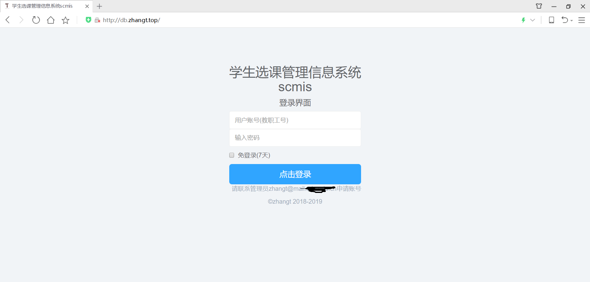
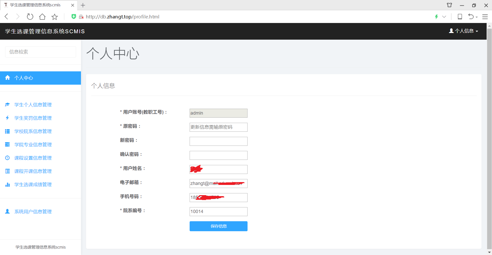
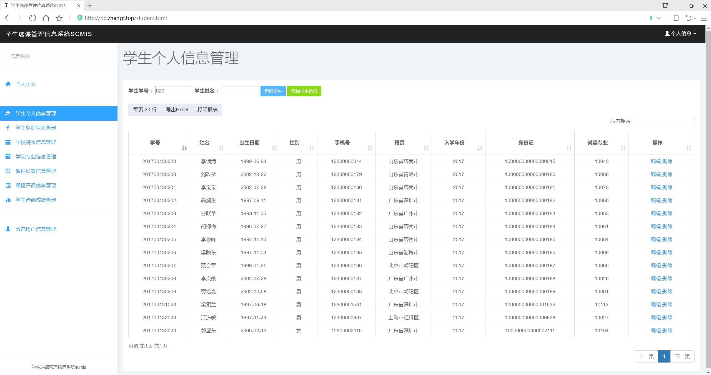
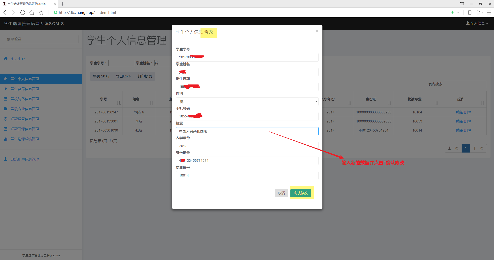
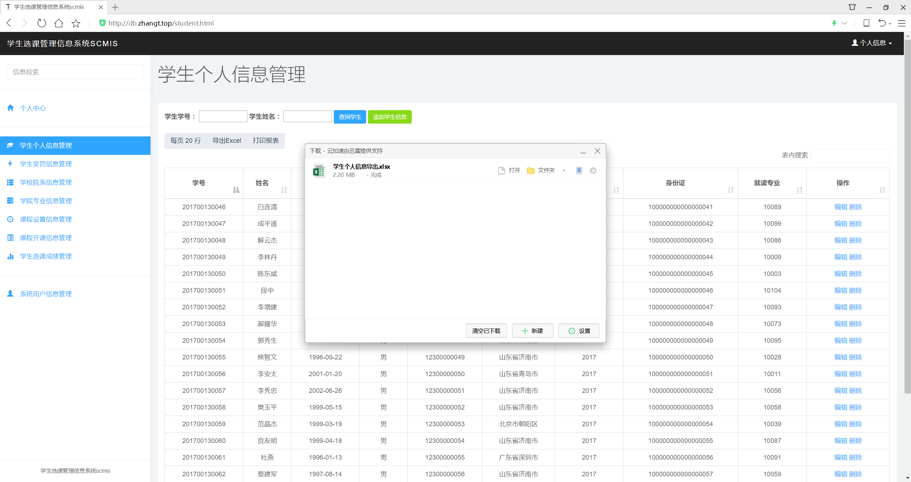
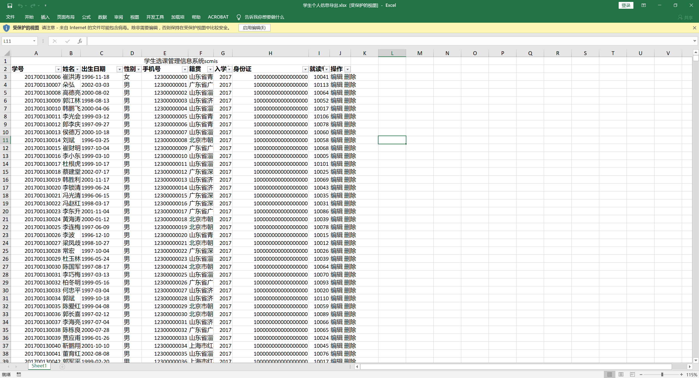
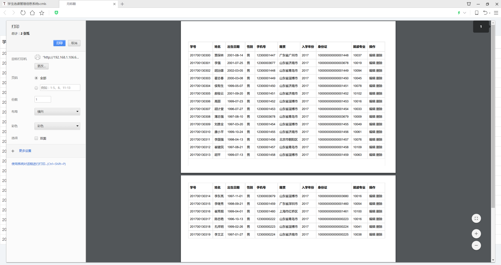
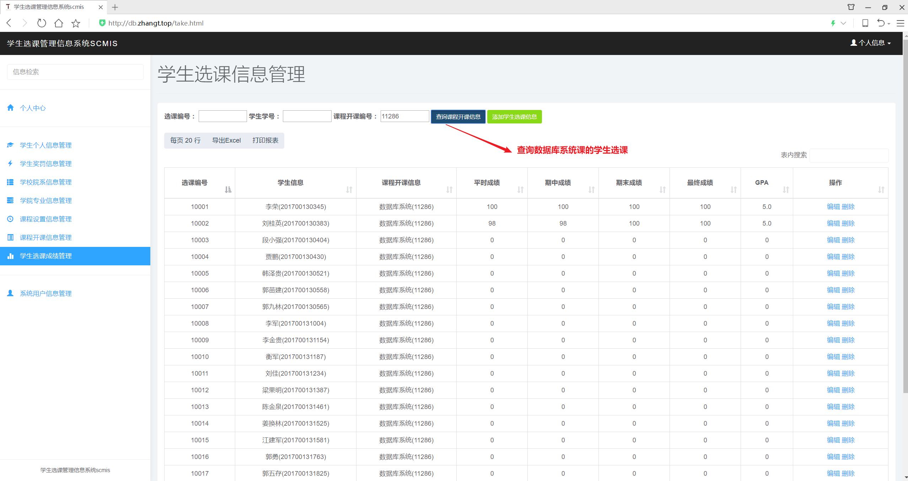

# SCMIS

一个学生选课管理信息系统——StudentCourseManagerInfoSystem(SCMIS)。数据库应用系统的设计实验。前后端分离开发，后端Tornado+Pymysql+Redis，前端Bootstrap+dataTables。

     [](https://opensource.org/licenses/Apache-2.0) 

## 目录

* [项目要求](#项目要求)
* [项目介绍](#项目介绍)
  * 前端展示
  * 目录结构
  * API文档

## 项目要求

> **题目名称：学生选课管理信息系统**  
>
> 选用主流DBMS、某种高级程序设计语言，实现一个完整的以数据库为核心的B/S架构的学生选课管理信息系统：
> - [x] 要求系统可以准确地记录和查询学生信息，包括学生的姓名、单位、年龄、性别以及身份证号码等。
> - [x] 要求系统可以准确地记录学生地每一次奖惩情况。
> - [x] 系统可以对学校的院系情况进行管理，包括设置学院名称、修改某学院某专业方向的名称等。
> - [x] 系统应该可以对基础数据进行维护。
> - [x] 系统能够对开设的课程进行管理
> - [x] 学生选课管理、考试（登记分数）、补考重修管理 
> - [x] 系统还应该提供强大数据统计、查询、报表生成以及打印等功能。
> - [x] 用户权限管理
> - [x] 异常提示功能服务端架设

## 项目介绍

* #### 前端展示











* #### 目录结构

  ```
  SCMIS
  │
  ├─backEnd             // 后端目录
  │  │  config.py       // 配置类
  │  │  constants.py    // 常量类
  │  │  DBInit.sql      // 数据库建模
  │  │  requirements.txt// 第三方库要求
  │  │  server.py       // 服务器类
  │  │  urls.py         // 路由映射
  │  ├─handlers         // 具体的请求处理类，按页面（业务）划分
  │  │      BaseHandler.py      // 基类
  │  │      CaseHandler.py      // 学生奖罚业务
  │  │      CourseHandler.py    // 课程设置业务
  │  │      DepartmentHandler.py// 学校院系业务
  │  │      MajorHandler.py     // 专业设置业务
  │  │      SectionHandler.py   // 课程开课业务
  │  │      StudentHandler.py   // 学生个人业务
  │  │      TakeHandler.py      // 学生选课业务
  │  │      UserHandler.py      // 系统用户业务
  │  ├─logs
  │  └─utils   // 工具类、第三方库
  │          commons.py        // 共用类
  │          DAO.py            // 对数据库操作的一些封装
  │          response_code.py  // 前后端通信响应码规约
  │          session.py        // 结合redis的session实现
  └─frontEnd             // 前端目录
      │  case.html       // 学生奖罚信息管理页
      │  course.html     // 课程设置信息管理页
      │  department.html // 学校院系信息管理页
      │  login.html      // 登录页
      │  major.html      // 专业设置信息管理页
      │  profile.html    // 个人信息页
      │  section.html    // 课程开课信息管理页
      │  student.html    // 学生个人信息管理页
      │  take.html       // 学生选课信息管理页
      │  user.html       // 系统用户信息管理页
      │ 
      └─static           // 前端静态资源目录
          │  favicon.ico
          ├─css
          │  ├─bootstrap
          │  ├─bootstrap-table
          │  ├─datatables
          │  └─nprogress
          ├─fonts
          └─js
              ├─bootstrap
              ├─bootstrap-table
              ├─datatables
              ├─jquery
              ├─nprogress
              └─scmis          // 本项目的js文件，主要是ajax
  ```

* #### [API文档](/api_doc.md)
